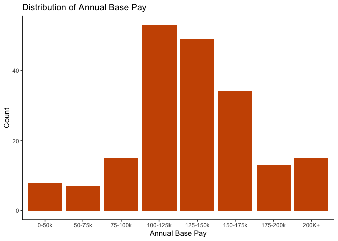
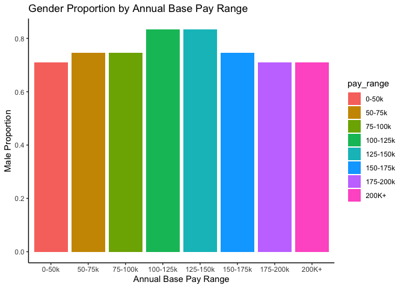
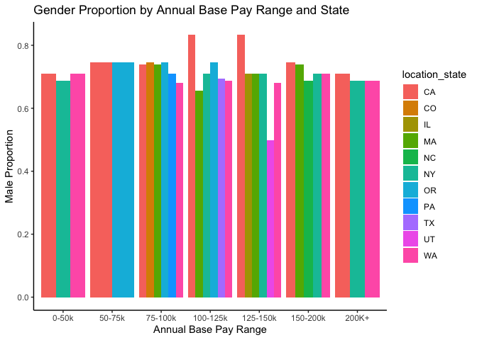

Project Report 1: Exploring Gender Diveristy in Tech
================
Isobel Bodefeld
2023-10-23

**Diversity in Tech**

``` r
# load in datasets

# survey results from a Hacker News survey of user salaries in the tech industry in 2016, providing detailed job titles, experience years, geographical locations, annual benefits, and signing and stock bonuses from employers
salaries_survey <- read_csv("salaries_clean.csv")
```

    ## Rows: 1655 Columns: 19
    ## ── Column specification ────────────────────────────────────────────────────────
    ## Delimiter: ","
    ## chr (10): employer_name, location_name, location_state, location_country, jo...
    ## dbl  (9): index, salary_id, location_latitude, location_longitude, total_exp...
    ## 
    ## ℹ Use `spec()` to retrieve the full column specification for this data.
    ## ℹ Specify the column types or set `show_col_types = FALSE` to quiet this message.

``` r
# workforce distributions by job category and race for 177 of the largest tech companies headquartered in Silicon Valley
raw_silicon <- read_csv("Reveal_EEO1_for_2016.csv")
```

    ## Warning: One or more parsing issues, call `problems()` on your data frame for details,
    ## e.g.:
    ##   dat <- vroom(...)
    ##   problems(dat)

    ## Rows: 3960 Columns: 6
    ## ── Column specification ────────────────────────────────────────────────────────
    ## Delimiter: ","
    ## chr (4): company, race, gender, job_category
    ## dbl (2): year, count
    ## 
    ## ℹ Use `spec()` to retrieve the full column specification for this data.
    ## ℹ Specify the column types or set `show_col_types = FALSE` to quiet this message.

**Introduction** In this project, I aim to explore diversity in the
technology industry. I was drawn to this topic because of my career
interest in technology/data science and hope to learn more about the
field while applying my data science skill set. I expect to see higher
salaries and positions for males as compared to their female
counterparts of other races, which tends to be the stereotype of the
industry.

Research question: Does company gender proportion differ by annual base
pay and/or by state?

The first data set is comprised of survey results from a Hacker News
survey of user salaries in the tech industry in 2016, providing detailed
job titles, experience years, geographical locations, annual benefits,
and signing and stock bonuses from employers. Each row contains a unique
survey entry/ participant and there are both numeric and categorical
variables.

The second data set is of demographics of the employees from 25
companies in Silicon Valley with data from EEO-1 reports, including
gender, race, and job category.

Both data sets were found through Kaggle. I plan to join them using the
company names found in each set, called employer_name and company.

sources:

Brandon Telle. 2016. Retrieved October 1, 2023.
<https://www.kaggle.com/datasets/thedevastator/know-your-worth-tech-salaries-in-2016>

RACHAEL TATMAN. 2017. Retrieved October 1, 2023.
<https://www.kaggle.com/datasets/rtatman/silicon-valley-diversity-data/versions/1/data>

Limitations to this analysis include: only male or female is listed as
options for gender in EEO-1 reports; the Silicon Valley data is from
2016 while the US census data is from 2013; and I don’t have data on who
applied to these companies.

``` r
# look at top 6 values for each dataset
head(salaries_survey)
```

    ## # A tibble: 6 × 19
    ##   index salary_id employer_name    location_name location_state location_country
    ##   <dbl>     <dbl> <chr>            <chr>         <chr>          <chr>           
    ## 1     0         1 opower           san francisc… CA             US              
    ## 2     1         3 walmart          bentonville,… AR             US              
    ## 3     2         4 vertical knowle… cleveland, oh OH             US              
    ## 4     3         6 netapp           waltham       <NA>           <NA>            
    ## 5     4        12 apple            cupertino     <NA>           <NA>            
    ## 6     5        14 casino           eastern oreg… OR             US              
    ## # ℹ 13 more variables: location_latitude <dbl>, location_longitude <dbl>,
    ## #   job_title <chr>, job_title_category <chr>, job_title_rank <chr>,
    ## #   total_experience_years <dbl>, employer_experience_years <dbl>,
    ## #   annual_base_pay <dbl>, signing_bonus <dbl>, annual_bonus <dbl>,
    ## #   stock_value_bonus <chr>, comments <chr>, submitted_at <chr>

``` r
head(raw_silicon)
```

    ## # A tibble: 6 × 6
    ##   company  year race   gender job_category                      count
    ##   <chr>   <dbl> <chr>  <chr>  <chr>                             <dbl>
    ## 1 23andMe  2016 Latino male   Executive/Senior officials & Mgrs     0
    ## 2 23andMe  2016 Latino male   First/Mid officials & Mgrs            1
    ## 3 23andMe  2016 Latino male   Professionals                         7
    ## 4 23andMe  2016 Latino male   Technicians                           0
    ## 5 23andMe  2016 Latino male   Sales workers                         0
    ## 6 23andMe  2016 Latino male   Administrative support                0

**Wrangling/Tidying raw_silicon Before Joining/Merging**

``` r
# convert the "count" column to numeric
raw_silicon$count <- as.numeric(raw_silicon$count)

# remove rows with missing values (N/A) in the "count" column
raw_silicon <- raw_silicon %>% na.omit()

# create a new data frame by grouping and summarizing the data
company_gender <- raw_silicon %>%
  group_by(company, gender) %>%
  summarize(count = sum(count)) %>%
  ungroup()
```

    ## `summarise()` has grouped output by 'company'. You can override using the
    ## `.groups` argument.

``` r
# extract male data and rename columns
silicon_demographics <- company_gender %>% filter(gender == "male") %>%
  select(-gender) %>%
  rename(male_count = count)

# extract female data and rename columns
femaleData <- company_gender %>% filter(gender == "female") %>%
  rename(female_count = count)

# calculate male proportion
silicon_demographics <- silicon_demographics %>%
  mutate(female_count = femaleData$female_count) %>%
  mutate(male_proportion = male_count / (male_count + female_count))

# calculate female proportion
silicon_demographics <- silicon_demographics %>%
  mutate(female_proportion = 1 - male_proportion)

# convert the "company" column to lowercase
silicon_demographics <- silicon_demographics %>%
  mutate(company = str_to_lower(company)) 

head(silicon_demographics)
```

    ## # A tibble: 6 × 5
    ##   company  male_count female_count male_proportion female_proportion
    ##   <chr>         <dbl>        <dbl>           <dbl>             <dbl>
    ## 1 23andme         296          298           0.498             0.502
    ## 2 adobe         14244         6661           0.681             0.319
    ## 3 airbnb         2943         2292           0.562             0.438
    ## 4 apple        157655        69223           0.695             0.305
    ## 5 cisco         82251        29115           0.739             0.261
    ## 6 facebook      21269         9659           0.688             0.312

The original data set raw_silicon that showed demographics of different
companies had 3640 observations. Now that these functions were performed
to show male and female proportions, the new data set
silicon_demographics has 22 observations. This tidies the data and makes
each row contain a unique company.

**Joining/Merging**

``` r
# join datasets using employer_name and company as ID variables
combined_temp <- inner_join(salaries_survey, silicon_demographics, by = c("employer_name" = "company"))
head(combined_temp)
```

    ## # A tibble: 6 × 23
    ##   index salary_id employer_name location_name    location_state location_country
    ##   <dbl>     <dbl> <chr>         <chr>            <chr>          <chr>           
    ## 1     4        12 apple         cupertino        <NA>           <NA>            
    ## 2    33        77 intel         hillsboro, oreg… OR             US              
    ## 3    47       112 linkedin      san jose, ca     CA             US              
    ## 4    70       159 apple         sunnyvale        <NA>           <NA>            
    ## 5    77       176 linkedin      1                <NA>           <NA>            
    ## 6    85       191 apple         95014            CA             US              
    ## # ℹ 17 more variables: location_latitude <dbl>, location_longitude <dbl>,
    ## #   job_title <chr>, job_title_category <chr>, job_title_rank <chr>,
    ## #   total_experience_years <dbl>, employer_experience_years <dbl>,
    ## #   annual_base_pay <dbl>, signing_bonus <dbl>, annual_bonus <dbl>,
    ## #   stock_value_bonus <chr>, comments <chr>, submitted_at <chr>,
    ## #   male_count <dbl>, female_count <dbl>, male_proportion <dbl>,
    ## #   female_proportion <dbl>

``` r
# count number of IDs the data sets have in common
num_combined_temp <- nrow(combined_temp)
num_combined_temp
```

    ## [1] 194

Using inner_join, only the ID variables common to both data sets are
kept. I use the variable “employer_name” from the survey data and the
variable “company” from the company demographics data. They have
overlapping companies but have different columns names so I combined the
variable names in order to join effectively. There are 194 IDs that each
data set have in common.

``` r
# count observations in salaries_survey data
total_obs_salaries_survey <- nrow(salaries_survey)
total_obs_salaries_survey
```

    ## [1] 1655

``` r
# count observations in silicon_demographics data
total_obs_silicon_demographics <- nrow(silicon_demographics)
total_obs_silicon_demographics
```

    ## [1] 22

Before joining, salaries_survey had 1655 observations and
silicon_demographics had 22 observations.

``` r
# IDs in salaries_survey data but not silicon_demographics data
missing_IDs_salaries_survey <- salaries_survey %>%
  anti_join(silicon_demographics, by = c("employer_name" = "company"))
missing_IDs_salaries_survey
```

    ## # A tibble: 1,461 × 19
    ##    index salary_id employer_name   location_name location_state location_country
    ##    <dbl>     <dbl> <chr>           <chr>         <chr>          <chr>           
    ##  1     0         1 opower          san francisc… CA             US              
    ##  2     1         3 walmart         bentonville,… AR             US              
    ##  3     2         4 vertical knowl… cleveland, oh OH             US              
    ##  4     3         6 netapp          waltham       <NA>           <NA>            
    ##  5     5        14 casino          eastern oreg… OR             US              
    ##  6     6        16 tetra tech      madison, wi   WI             US              
    ##  7     7        17 knewton         new york city NY             US              
    ##  8     8        21 amplify         nyc           <NA>           <NA>            
    ##  9     9        23 sqor            san francisco <NA>           <NA>            
    ## 10    10        24 pensco trust c… denver, co    CO             US              
    ## # ℹ 1,451 more rows
    ## # ℹ 13 more variables: location_latitude <dbl>, location_longitude <dbl>,
    ## #   job_title <chr>, job_title_category <chr>, job_title_rank <chr>,
    ## #   total_experience_years <dbl>, employer_experience_years <dbl>,
    ## #   annual_base_pay <dbl>, signing_bonus <dbl>, annual_bonus <dbl>,
    ## #   stock_value_bonus <chr>, comments <chr>, submitted_at <chr>

``` r
num_missing_IDs_salaries_survey <- nrow(missing_IDs_salaries_survey)
num_missing_IDs_salaries_survey
```

    ## [1] 1461

``` r
# IDs in silicon_demographics data but not salaries_survey data
missing_IDs_silicon_demographics <- silicon_demographics %>%
  anti_join(salaries_survey, by = c("company" = "employer_name"))
missing_IDs_silicon_demographics
```

    ## # A tibble: 4 × 5
    ##   company    male_count female_count male_proportion female_proportion
    ##   <chr>           <dbl>        <dbl>           <dbl>             <dbl>
    ## 1 hp inc.         67136        32241           0.676             0.324
    ## 2 mobileiron       1096          473           0.699             0.301
    ## 3 pinterest        1417         1058           0.573             0.427
    ## 4 view             1060          212           0.833             0.167

``` r
num_missing_IDs_silicon_demographics <- nrow(missing_IDs_silicon_demographics)
num_missing_IDs_silicon_demographics
```

    ## [1] 4

1461 IDs appeared in the salaries_survey data but not the
silicon_demographics data. 4 IDs appeared in the silicon_demographics
data but not the salaries_survey data. The observations that were
dropped while combining are above.

There may be possible issues in not being able to explore the diversity
of all companies listed from the survey, but the company demographics
data limits exploration to the companies present within it.

Note: I exported the combined data set to Excel and manually filled out
the location_state and location_country columns.

``` r
# loading in updated combined data set with states and countries
combined <- read_csv("combined_updated.csv")
```

    ## Rows: 194 Columns: 23
    ## ── Column specification ────────────────────────────────────────────────────────
    ## Delimiter: ","
    ## chr (10): employer_name, location_name, location_state, location_country, jo...
    ## dbl (13): index, salary_id, location_latitude, location_longitude, total_exp...
    ## 
    ## ℹ Use `spec()` to retrieve the full column specification for this data.
    ## ℹ Specify the column types or set `show_col_types = FALSE` to quiet this message.

``` r
head(combined)
```

    ## # A tibble: 6 × 23
    ##   index salary_id employer_name location_name    location_state location_country
    ##   <dbl>     <dbl> <chr>         <chr>            <chr>          <chr>           
    ## 1     4        12 apple         cupertino        CA             US              
    ## 2    33        77 intel         hillsboro, oreg… OR             US              
    ## 3    47       112 linkedin      san jose, ca     CA             US              
    ## 4    70       159 apple         sunnyvale        CA             US              
    ## 5    77       176 linkedin      1                CA             US              
    ## 6    85       191 apple         95014            CA             US              
    ## # ℹ 17 more variables: location_latitude <dbl>, location_longitude <dbl>,
    ## #   job_title <chr>, job_title_category <chr>, job_title_rank <chr>,
    ## #   total_experience_years <dbl>, employer_experience_years <dbl>,
    ## #   annual_base_pay <dbl>, signing_bonus <dbl>, annual_bonus <dbl>,
    ## #   stock_value_bonus <chr>, comments <chr>, submitted_at <chr>,
    ## #   male_count <dbl>, female_count <dbl>, male_proportion <dbl>,
    ## #   female_proportion <dbl>

**Wrangling Merged Data**

``` r
# calculate summary statistics for annual base pay
summary_annual_base_pay <- combined %>%
  summarise(
    Mean_Annual_Pay = mean(annual_base_pay, na.rm = TRUE),
    Median_Annual_Pay = median(annual_base_pay, na.rm = TRUE),
    Min_Annual_Pay = min(annual_base_pay, na.rm = TRUE),
    Max_Annual_Pay = max(annual_base_pay, na.rm = TRUE)
  )
summary_annual_base_pay
```

    ## # A tibble: 1 × 4
    ##   Mean_Annual_Pay Median_Annual_Pay Min_Annual_Pay Max_Annual_Pay
    ##             <dbl>             <dbl>          <dbl>          <dbl>
    ## 1         217106.            131000             40       10280000

``` r
# calculate summary statistics for total experience years
summary_total_experience_years <- combined %>%
  summarise(
    Mean_total_experience_years = mean(total_experience_years, na.rm = TRUE),
    Median_total_experience_years = median(total_experience_years, na.rm = TRUE),
    Min_total_experience_years = min(total_experience_years, na.rm = TRUE),
    Max_total_experience_yearsy = max(total_experience_years, na.rm = TRUE)
  )
summary_total_experience_years
```

    ## # A tibble: 1 × 4
    ##   Mean_total_experience_years Median_total_experience_y…¹ Min_total_experience…²
    ##                         <dbl>                       <dbl>                  <dbl>
    ## 1                        6.01                           4                      0
    ## # ℹ abbreviated names: ¹​Median_total_experience_years,
    ## #   ²​Min_total_experience_years
    ## # ℹ 1 more variable: Max_total_experience_yearsy <dbl>

``` r
# calculate summary statistics for job title category
summary_job_title <- combined %>%
  group_by(job_title_category) %>%
  summarise(
    Count = n(),
    Unique_Count = n_distinct(employer_name),
    Median_Annual_Pay = median(annual_base_pay, na.rm = TRUE),
    Mean_Annual_Pay = mean(annual_base_pay, na.rm = TRUE)
  )
summary_job_title
```

    ## # A tibble: 6 × 5
    ##   job_title_category Count Unique_Count Median_Annual_Pay Mean_Annual_Pay
    ##   <chr>              <int>        <int>             <dbl>           <dbl>
    ## 1 Data                   4            3            125000         139250 
    ## 2 Engineering           21            9            117000         119089.
    ## 3 Management            10            5            170000        1190604 
    ## 4 Other                 17           10            161000         283915.
    ## 5 Software             137           16            131000         158374.
    ## 6 Web                    5            3            120000         126200

After calculating summary statistics for annual base pay, I found the
mean of \$217106.40 to be significantly higher than the median of
\$131,000. This means there are more high annual pay outliers drawing
the mean up (lower outliers have less of an effect). Because the minimum
and maximum are drastically different from each other, I would opt to
use the median when describing the center of the data.

For the summary statistics of total experience years, I found the mean
to be 6 years and the median to be 4 years. With a minimum and 0 years
and maximum of 30 years, the statistics that describe the center suggest
that the participants tend to be less far along in their career which
just a few years of experience.

As for job title category, the majority of participants were in software
with the count be 137 participants and the next highest being 21. The
median annual pays are all between \$110,000 and \$170,000 whereas the
mean annual pays had some higher values. In management, the highest mean
was \$1,190,604 which suggests high outlier(s) that draw this value up.
For both median and mean, management was the job title category with the
highest value whereas engineering had the lowest value.

**Visualizing**

``` r
# visualization with 1 variable

# define the bin widths
pay_ranges <- c(0, 50000, 75000, 100000, 125000, 150000, 175000, 200000, Inf)

# add a factor variable with labels for the bins using mutate
combined_data_1 <- combined %>% 
  mutate(annual_base_pay_ranges = cut(annual_base_pay, breaks = pay_ranges, labels = c("0-50k", "50-75k", "75-100k", "100-125k", "125-150k", "150-175k", "175-200k", "200K+")))

# create a histogram
combined_data_1 %>% 
  ggplot(aes(x = annual_base_pay_ranges)) +
  geom_bar(fill = "#CC5500") +
  labs(x = "Annual Base Pay", y = "Count") +
  ggtitle("Distribution of Annual Base Pay") + 
  theme_classic()
```

<!-- -->

This barplot shows the distribution of the amount of participants that
fall into each of the annual base pay ranges. It is easy to see that the
\$100-125k, \$125-150k and \$150-175k annual base pay ranges are the top
3, respectively, highest ranges for number of participants that earn
that much. The \$50-75k range has the lowest amount of participants. I
should point out that some observations contain interns rather than
full-time employees, so there are more earning less that \$50k.

``` r
# visualization with 2 variables

# define custom pay ranges
pay_ranges <- c(0, 50000, 75000, 100000, 125000, 150000, 175000, 200000, Inf)

# Create a new variable "pay_range" based on the custom ranges
combined_data_2 <-combined %>%
  mutate(pay_range = cut(annual_base_pay, breaks = pay_ranges, labels = c("0-50k", "50-75k", "75-100k", "100-125k", "125-150k", "150-175k", "175-200k", "200K+"), right = FALSE))

# grouped bar plot with companies as groups and states as bars within each group
ggplot(combined_data_2, aes(x = pay_range, y = male_proportion, fill = pay_range)) +
  geom_bar(stat = "identity", position = "dodge") +
  labs(title = "Gender Proportion by Annual Base Pay Range", x = "Annual Base Pay Range", y = "Male Proportion") +
  theme(axis.text.x = element_text(angle = 45, hjust = 1)) + 
  theme_classic()
```

<!-- -->

In this visualization, I add male proportion as another variables so I
can explore how company gender proportion varies by annual base pay.
Through this barplot we can see that the \$100-125k and \$125-150k
ranges have the highest proportion of males at their companies. However,
there are also more observations for these ranges so it is hard to make
definitive conclusions.

``` r
# visualization with 3 variables

# define custom pay ranges
pay_ranges <- c(0, 50000, 75000, 100000, 125000, 150000, 200000, Inf)

# create new variable "pay_range" based on the custom ranges
combined_data_3 <- combined %>%
  filter(!is.na(location_state)) %>%
  mutate(pay_range = cut(annual_base_pay, breaks = pay_ranges, labels = c("0-50k", "50-75k", "75-100k", "100-125k", "125-150k", "150-200k", "200K+"), right = FALSE))

# grouped bar plot by pay range and state
ggplot(combined_data_3, aes(x = pay_range, y = male_proportion, fill = location_state)) +
  geom_bar(stat = "identity", position = "dodge") +
  labs(title = "Gender Proportion by Annual Base Pay Range and State",
       x = "Annual Base Pay Range", y = "Male Proportion") +
  theme(axis.text.x = element_text(angle = 45, hjust = 1)) + 
  theme_classic()
```

<!-- -->

By adding state, I aim to explore how gender proportion varies both by
annual base pay and by state. For many of the pay ranges, California had
the highest proportion of males. In addition, there is no clear
relationship between male proportion and annual base pay nor state. It
is notable to point out that a majority of the observations were of
participants who work in California.
